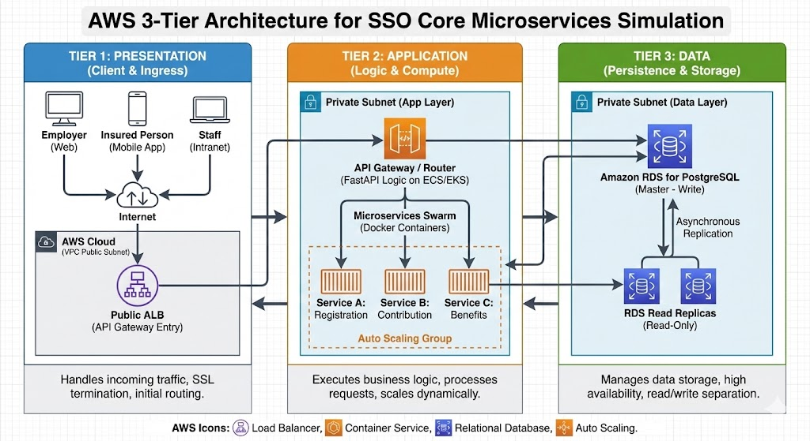

<h1 align="center"><b> AWS 3-Tier Architecture Microservices Simulation</h1>

---

 
    Com-Simulation-Modelling-AnyLogic-AWS-3-Tier  คือการจำลองและวิเคราะห์ประสิทธิภาพการเปลี่ยนผ่านระบบโดยอ้างอิงหลักการ AWS 3-Tier Architecture  โดยอ้างอิงจากเหตุการจริงจาก SSO Core Application  ไปสู่สถาปัตยกรรม Microservices เพื่อลดปัญหาระบบล่มช่วง Go-Live 

## 📝 Table of Contents

- [About](#about)
- [Architecture Blueprint](#architecture)
- [Modules in the project](#modules)
- [Getting Started](#getting_started)
- [Usage](#usage)
- [Built Using](#built_using)
- [Authors](#authors)
- [Acknowledgments](#acknowledgement)

## 🧐 About | เกี่ยวกับโปรเจค 

 
  

This Final <b>Project in Computer Simulation and Modelling ( Code : 09155302 )</b>  
<b>INSTRUCTOR : </b>[Assistant Professor Pongpon Nilaphruek](https://www.linkedin.com/in/pongpon-nilaphruek-01a30335/) 
<b>NAME :	</b>[Mr.THANAPHOL NANTAKASET](https://www.linkedin.com/in/satangthevalue/) 
<b>FACULTY :</b>	[Science and Technology](https://www.sci.rmutt.ac.th/) 
<b>PROGRAM :</b>	[Big Data Management and Analytics](https://www.bigdata.rmutt.ac.th/)  

## 🏗 Architecture Blueprint | โครงสร้างสถาปัตยกรรม 
โปรเจคนี้จำลองสถาปัตยกรรมแบบ 3-Tier ประกอบด้วย:
1. **Presentation Tier (ชั้นแสดงผล - หน้าบ้าน)** Client Sources (Web, Mobile, Intranet)
    - หน้าที่ในระบบไอที: เป็นส่วนที่ติดต่อกับผู้ใช้งานโดยตรง (User Interface) ทำหน้าที่รับคำสั่งและแสดงผลลัพธ์ให้ผู้ใช้เห็น โดยที่ชั้นนี้จะ ไม่มีการประมวลผลข้อมูลหนักๆ หรือเก็บข้อมูลถาวร
    - AnyLogic: คือ Block ประเภท Source ที่ทำหน้าที่สร้าง Agent (ผู้ใช้งาน) ปล่อยเข้าสู่ระบบตามตารางเวลา (Schedule)
2. **Application Tier:** API Gateway (FastAPI) & Docker Swarm Microservices
    -หน้าที่ในระบบไอที: เป็น "สมอง" ของระบบ (Business Logic) ทำหน้าที่รับ Request จากหน้าบ้าน มาคำนวณ ตรวจสอบสิทธิ์ และประมวลผล เป็นชั้นที่ทำงานหนักที่สุดในระบบไอที โดยที่ชั้นนี้จะมีการประมวลผลข้อมูลและตัดสินใจต่างๆ ที่ซับซ้อนมากขึ้น
    - AnyLogic: คือ Block ประเภท Queue และ Service ที่จำลองการรอคิวและเวลาประมวลผลของ API Gateway และ Microservices โดยที่ชั้นนี้จะมีการจำลองคิวและเวลาประมวลผลที่แตกต่างกันไปตามแต่ละ Service (เช่น Authentication, Data Processing, Reporting) โดยที่ชั้นนี้จะมีการจำลองคิวและเวลาประมวลผลที่แตกต่างกันไปตามแต่ละ Service (เช่น Authentication, Data Processing, Reporting)
3. **Data Tier:** PostgreSQL Database Resource Pool (Master/Replica) 
    - หน้าที่ในระบบไอที: ทำหน้าที่จัดเก็บและเรียกคืนข้อมูลอย่างปลอดภัยและถาวร (Database) โดยที่ชั้นนี้จะมีการจัดการข้อมูลที่ซับซ้อนและต้องการความน่าเชื่อถือสูง เช่น การจัดการฐานข้อมูล (Database Management) การสำรองข้อมูล (Backup) และการกู้คืนข้อมูล (Recovery)
    - AnyLogic: คือ Block ประเภท Resource Pool ที่จำลองการจัดการ Connection Contention ระหว่าง Master และ Replica Database โดยที่ชั้นนี้จะมีการจำลองการจัดการ Connection Contention ระหว่าง Master และ Replica Database โดยที่ชั้นนี้จะมีการจำลองการ

---

<h1> Overall | ภาพรวมและพารามิเตอร์ของโมเดล (AnyLogic 8.5.2) </h1> 
 
 อ้างอิงจากการพัฒนาโมเดลใน AnyLogic 8.5.2 (อ้างอิงจากไฟล์ `SSO_Simulation_Project`) ได้มีการตั้งค่าสถาปัตยกรรมและพารามิเตอร์ของบล็อค (Blocks) ในการจำลองดังนี้:

### 1. Presentation Tier (ฝั่งจำลองผู้ใช้งาน)
* **Source_Peak (Block: Source)**
    * **Agent Type:** `UserRequest`
    * **Arrival Type:** ควบคุมอัตราการเข้าใช้งานผ่านตารางเวลา `PeakTrafficSchedule`
    * **Logic (onAtExit):** จำลองสัดส่วนผู้ใช้งาน 3 กลุ่ม ได้แก่ 
        * `INSURED` (ผู้ประกันตน) = 70%
        * `EMPLOYER` (นายจ้าง) = 20%
        * `STAFF` (เจ้าหน้าที่) = 10%

### 2. Application Tier (ฝั่ง API Gateway)
* **Check_Capacity (Block: SelectOutput)**
    * **Condition:** `GatewayBuffer.size() < 500` (เพื่อตรวจสอบว่าคิวหน้า Gateway ล้นหรือไม่ หากล้นจะปัดตกไปที่ `Sink_Gateway_503`)
* **GatewayBuffer (Block: Queue)**
    * **Capacity:** `500` (จำกัดคิวสูงสุด)
    * **Timeout:** เปิดใช้งานที่ `30 SECOND` (หากรอในคิวนานเกิน 30 วินาที จะตัด Request ทิ้งไปยัง `TimeOut` Sink)
* **FastAPI_Process (Block: Delay)**
    * **Delay Time:** กระจายตัวแบบ `triangular(0.01, 0.02, 0.05)` วินาที 
    * **Logic (onExit):** ทำหน้าที่เป็น Router ตรวจสอบ `agent.userType` เพื่อกำหนดค่า `agent.targetService` ในการส่งต่อไปยัง Microservices (เช่น EMPLOYER ไป Service 1, STAFF ไป Service 4)
* **Router (Block: SelectOutput5)**
    * กระจาย Traffic ไปยัง Service 1 ถึง 4 ตามค่า `agent.targetService`

### 3. Application Tier (ฝั่ง Microservices)
* **Service_Reg (ระบบทะเบียน)**
    * **Delay Time:** `triangular(0.1, 0.2, 0.3)` วินาที
    * **Resource:** เรียกใช้ `DB_Connections`
* **Service_Contrib (ระบบเงินสมทบ)**
    * **Delay Time:** `triangular(0.2, 0.5, 0.8)` วินาที
    * **Resource:** เรียกใช้ `DB_Connections`
* **Service_Benefits (ระบบสิทธิประโยชน์)**
    * **Delay Time:** `triangular(0.3, 0.6, 1.0)` วินาที
    * **Resource:** เรียกใช้ `DB_Connections`
* **Service_Accounting (ระบบบัญชี)**
    * **Delay Time:** `triangular(0.5, 1.0, 2.0)` วินาที
    * **Resource:** เรียกใช้ `DB_Connections`

### 4. Data Tier (ฝั่งฐานข้อมูล)
* **DB_Connections (Block: ResourcePool)**
    * **Capacity:** `100` Connections (จำลองจำนวน Connection สูงสุดของฐานข้อมูล หาก Microservices เรียกใช้เกินกว่านี้จะเกิดอาการ System Lag และต้องรอคิว)

 

 

### 🏁 Getting Started | เริ่มต้นใช้งาน 

โปรเจคนี้ถูกพัฒนาขึ้นบนโปรแกรม AnyLogic 8.5.2

### Prerequisites | ข้อกำหนดเบื้องต้น

 - AnyLogic 8.5.2 หรือใหม่กว่า (สามารถดาวน์โหลดได้ที่ [AnyLogic Official Website](https://www.anylogic.com/))
 - คอมพิวเตอร์ที่มีสเปคเพียงพอสำหรับรันโมเดลจำลอง (แนะนำ RAM 4GB ขึ้นไป)
 - ความรู้พื้นฐานเกี่ยวกับการใช้งาน AnyLogic และการจำลองระบบไอที